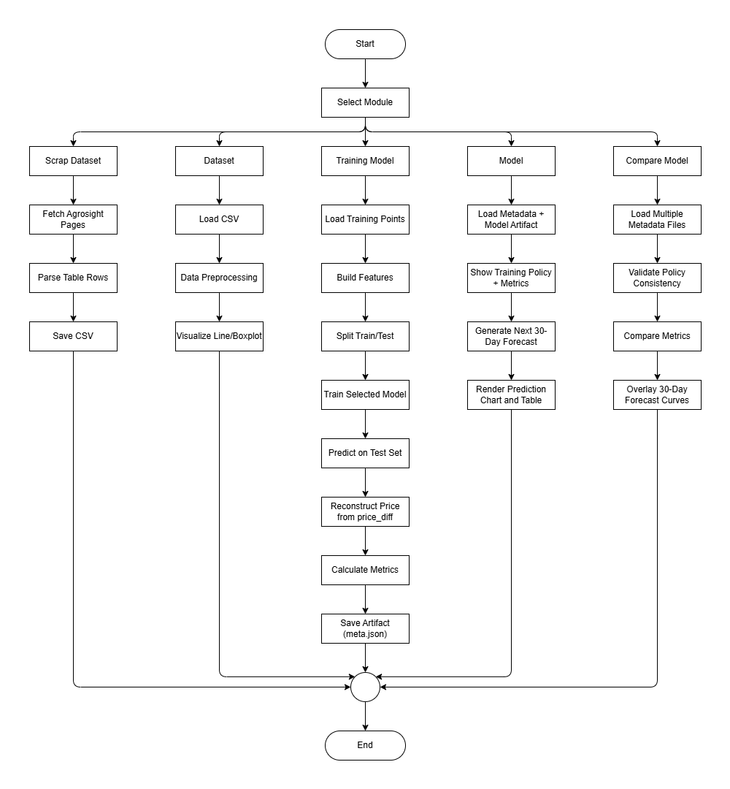

# Crop Price Prediction System Documentation

## ABSTRACT

The **Crop Price Prediction (CPP) system** is a practical data-driven application designed to forecast short-term agricultural commodity prices using historical market data. The project combines web scraping, preprocessing, machine learning model training, and interactive visualization within a single Streamlit application. Data is collected from Agrosight market listings, transformed into structured datasets, and used to train forecasting models such as XGBoost, LightGBM, CatBoost, and a hybrid SARIMA + ElasticNet approach. The current training pipeline uses a unified difference-target strategy (`price_diff`) and reconstructs absolute price for evaluation and forecasting. The system outputs model evaluation metrics and next 30-day price forecasts to support early decision-making for market participants.

## INTRODUCTION

### 1.1 Introduction

The **Crop Price Prediction (CPP)** system is an intelligent, data-driven platform designed to support agricultural market forecasting. By integrating web scraping, data preprocessing, machine learning model training, and interactive analytics, CPP connects traditional market monitoring with modern predictive technology. Built with modular components, the system supports consistent model experimentation, metadata-driven reproducibility, and practical forecasting workflows for farmers, traders, and analysts.

### 1.2 Objectives

- To deliver a robust, user-friendly platform for scraping, managing, and visualizing crop-price datasets.
- To train and compare multiple forecasting models (XGBoost, LightGBM, CatBoost, SARIMA + ElasticNet) under consistent data-processing workflows.
- To implement reproducible model lifecycle management using saved artifacts and metadata policies.
- To generate short-term (next 30 days) price forecasts to support data-informed agricultural decisions.
- To establish a foundation for future enhancements such as richer external features, automated retraining, and advanced analytics dashboards.

### 1.3 Motivation

Conventional crop-price tracking is often manual, fragmented, and reactive, making it difficult to respond early to market changes. This project is motivated by the need to shift toward smart, data-driven forecasting tools that capture patterns in historical prices and provide actionable insights in advance. By combining structured preprocessing, comparative model training, and forecast visualization, CPP aims to improve planning quality and reduce uncertainty in agricultural decision-making.

### 1.4 System Specifications

- Data Sources: Agrosight market pages scraped via URL and pagination controls.
- Core Features: Dataset scraping (CSV/JSON), preprocessing, model training, model comparison, and 30-day forecasting.
- Model Pipeline: Unified feature engineering with `price_diff`-aware target handling and recursive forecast reconstruction.
- Technology Stack: Python, Streamlit, requests, BeautifulSoup, XGBoost, LightGBM, CatBoost, scikit-learn, statsmodels, pandas, Altair.
- Storage Structure: `dataset/csv`, `dataset/json`, `Model/` artifacts (`.ubj`, `.txt`, `.cbm`, `.pkl`) and `.meta.json` metadata.
- UI/UX Design: Clean Streamlit interface with pages for Home, Scrap Dataset, Dataset, Training Model, Model, and Compare Model.

### 1.5 Methodology

- Requirement Analysis and Market Data Scope Definition
- Data Collection via Web Scraping and Output Validation
- Dataset Cleaning, Date/Price Normalization, and Outlier Handling
- Feature Engineering and Train/Test Preparation
- Multi-model Training and Metric-based Evaluation
- Model Serialization, Metadata Generation, and Policy Tracking
- Forecast Generation, Visualization, and End-to-end System Testing

## SYSTEM ARCHITECTURE & DESIGN

### 2.1 System Overview (System Flow Diagram)

The system flow begins with market data collection and continues through preprocessing, model training, evaluation, metadata persistence, and future prediction delivery in the Streamlit interface. The diagram below summarizes the operational pipeline used by CPP.

### 2.2 Architecture Style

CPP is implemented using a **modular, data-pipeline-driven architecture**, where responsibilities are separated by component boundaries. From data collection to prediction delivery, the workflow is coordinated through page-level orchestration and metadata-based model policies, enabling both maintainability and reproducibility.

### 2.3 Logical Layer Design

The system is organized into four logical layers:

- **Presentation Layer (Streamlit UI):** Handles user interaction through Home, Scrap Dataset, Dataset, Training Model, Model, and Compare Model pages.
- **Application/Orchestration Layer:** Connects page actions to preprocessing, training, and forecasting routines, and controls end-to-end use-case execution.
- **Model & Analytics Layer:** Trains, evaluates, and forecasts using XGBoost, LightGBM, CatBoost, and SARIMA + ElasticNet, while computing prediction metrics.
- **Data & Persistence Layer:** Stores datasets in `dataset/csv` and `dataset/json`, and persists model artifacts and `.meta.json` metadata in `Model/`.

### 2.4 Core Module Responsibilities

- **Scraper Module (`agrosight_scraper.py`):** Collects raw market rows from Agrosight and exports structured CSV/JSON outputs.
- **Training Module (`training_model.py`):** Executes feature engineering, train/test preparation, model fitting, metric evaluation, and artifact serialization.
- **App/UI Module (`streamlit_app.py`):** Orchestrates user workflows, data visualization, model loading, and 30-day forecast presentation.
- **Documentation & Governance (`system_documents/`):** Maintains calculation rules, process descriptions, and system design rationale.

### 2.5 End-to-End Data Flow

The operational workflow can be summarized as follows:

1. The user provides a source URL and pagination scope on the Scrap Dataset page.
2. The scraper collects raw rows and saves structured files to `dataset/csv` and `dataset/json`.
3. The Dataset page applies preprocessing, including date normalization, numeric parsing, and missing/outlier handling.
4. The Training Model page trains and evaluates the selected algorithm, then persists artifacts and metadata in `Model/`.
5. The Model and Compare Model pages load saved models and present 30-day forecasts with metric-based comparisons.

### 2.6 Model Lifecycle & Metadata Policy

CPP manages model lifecycle with a metadata-driven strategy:

- Each trained model is stored with an artifact file (`.ubj`, `.txt`, `.cbm`, `.pkl`) and companion metadata (`.meta.json`).
- Metadata captures dataset context, feature policy, evaluation metrics, and configuration summary for traceable results.
- During inference, metadata checks help reduce training-serving mismatch and improve deployment consistency.

### 2.7 Applied Design Principles

- **Separation of Concerns:** Scraping, training, inference, and UI responsibilities are isolated by module.
- **Reproducibility:** Artifact and metadata policies support consistent reruns and comparable results.
- **Extensibility:** The architecture allows straightforward integration of new models or feature pipelines.
- **Usability:** A workflow-centric Streamlit interface supports both technical and non-technical users.
- **Practical Forecast Delivery:** Evaluation outputs are paired with next 30-day forecasts for decision-oriented interpretation.

## THEORY BACKGROUND

### 1) Time-Series Forecasting in Agriculture

Time-series forecasting estimates future values based on historical observations ordered by time. For crop prices, recurring patterns (seasonality), short-term persistence (autocorrelation), and sudden shocks (outliers) are common. A robust pipeline should therefore combine temporal features, lag information, and noise handling.

### 2) Used Feature Engineering Principles

The project derives predictive signals from observed price history, including:

- Calendar features: day index, day of week, day of month, month, week of year
- Lag features: previous-day and previous-week prices
- Moving statistics: 7-day and 30-day moving averages
- Volatility and momentum proxies
- Price difference/change-related attributes

These engineered variables help models learn trend, periodicity, and local fluctuations.

### 3) Model Families Implemented

#### 3.1 XGBoost Regressor

XGBoost is a gradient-boosted decision-tree method where trees are added sequentially to correct previous residual errors. In each boosting round, the model minimizes an objective composed of prediction loss and regularization, which helps control overfitting. In the current pipeline, XGBoost is trained on `price_diff` and predicted differences are reconstructed into price values. This setup helps the model focus on short-term movement while preserving nonlinear learning ability across lag values, moving averages, momentum, and calendar effects.

Key theoretical characteristics:

- High nonlinear modeling capacity for tabular time-derived features.
- Strong bias-variance control through tree depth, learning rate, and regularization.
- Good handling of mixed feature interactions without explicit manual interaction terms.

#### 3.2 LightGBM Regressor

LightGBM is also a gradient-boosting tree method, but it is optimized for speed and memory via histogram-based binning and leaf-wise tree growth. This design often trains faster while maintaining strong predictive performance. In this project, LightGBM also follows `price_diff` target training and reconstructs prices after prediction, enabling faster iterative experiments under the same movement-target setting.

Key theoretical characteristics:

- Efficient training through histogram approximation of continuous features.
- Leaf-wise growth can improve fit quality but may require regularization to prevent overfitting.
- Well suited for medium-to-large tabular datasets with frequent retraining.

#### 3.3 CatBoostRegressor

CatBoost is a boosting algorithm designed for stability and reduced prediction shift through ordered boosting. In this project, CatBoost is configured with Huber loss, which is robust to outliers compared with pure squared-error loss. CatBoost also uses `price_diff` (day-to-day price change) and reconstructs absolute price, which can stabilize learning in trending market series.

Key theoretical characteristics:

- Robust optimization behavior under noisy observations using robust loss.
- Strong nonlinear fit while maintaining practical stability.
- Difference-target strategy can reduce trend-scale sensitivity in short-horizon forecasting.

#### 3.4 SARIMA + ElasticNet (Hybrid)

This hybrid combines two modeling views:

- **SARIMA** (Seasonal AutoRegressive Integrated Moving Average) models autocorrelation and differencing-based temporal structure in the raw series.
- **ElasticNet** models the relationship between engineered features and target values with both L1 and L2 regularization.

The project combines both predictions by averaging, so the final estimate benefits from statistical time-series structure (SARIMA) and feature-driven regression signals (ElasticNet). In the latest pipeline, the hybrid output is used in `price_diff` mode and reconstructed to absolute price in recursive forecasting.

Key theoretical characteristics:

- Higher interpretability than pure tree-boosting methods.
- Useful when serial dynamics are strong and regularization is needed for feature effects.
- Hybridization can reduce single-model bias by blending complementary assumptions.

Using multiple model families reduces over-reliance on one hypothesis and supports comparative evaluation across nonlinear, statistical, and hybrid forecasting paradigms.

### 4) Theoretical Comparison Matrix (XGBoost, LightGBM, CatBoost, SARIMA + ElasticNet)

The matrix below summarizes expected theoretical behavior of each model family in the context of crop-price forecasting with engineered tabular time-series features.

| Model               | Core Learning Principle                                                   | Nonlinear Capacity | Training Efficiency | Noise/Outlier Robustness         | Interpretability | Best Theoretical Fit                                                   |
| ------------------- | ------------------------------------------------------------------------- | ------------------ | ------------------- | -------------------------------- | ---------------- | ---------------------------------------------------------------------- |
| XGBoost Regressor   | Sequential gradient-boosted trees with regularization                     | High               | Medium              | Medium                           | Medium           | Complex nonlinear interactions among lag, trend, and calendar features |
| LightGBM Regressor  | Histogram-based, leaf-wise gradient-boosted trees                         | High               | High                | Medium                           | Medium           | Fast experimentation and scalable boosting on tabular features         |
| CatBoostRegressor   | Ordered boosting with robust loss behavior                                | High               | Medium              | Medium-High                      | Medium           | Noisy market data under robust-loss and difference-target training     |
| SARIMA + ElasticNet | Hybrid of statistical time-series model and regularized linear regression | Low-Medium         | Medium              | Medium (preprocessing-dependent) | High             | Structured autocorrelation + interpretable feature effects             |

Interpretation guideline:

- If priority is nonlinear predictive power, boosted tree models are generally favored.
- If priority is speed for repeated training cycles, LightGBM is theoretically strong.
- If priority is robustness to abrupt market noise, CatBoost with robust loss is attractive.
- If priority is interpretability and explicit time-series structure, SARIMA + ElasticNet is preferred.

### 5) Evaluation Metrics

The application reports common regression metrics:

- R² (coefficient of determination)
- MAE (Mean Absolute Error)
- RMSE (Root Mean Squared Error)
- MAPE (Mean Absolute Percentage Error)
- Accuracy (project-defined summary metric in metadata/output)

Mathematical definitions (for actual values $y_i$, predicted values $\hat{y}_i$, sample size $n$, and mean actual $\bar{y}=\frac{1}{n}\sum_{i=1}^{n}y_i$):

- **R² (coefficient of determination)**

$$
R^2 = 1 - \frac{\sum_{i=1}^{n}(y_i-\hat{y}_i)^2}{\sum_{i=1}^{n}(y_i-\bar{y})^2}
$$

- **MAE (Mean Absolute Error)**

$$
\mathrm{MAE} = \frac{1}{n}\sum_{i=1}^{n}\left|y_i-\hat{y}_i\right|
$$

- **RMSE (Root Mean Squared Error)**

$$
\mathrm{RMSE} = \sqrt{\frac{1}{n}\sum_{i=1}^{n}(y_i-\hat{y}_i)^2}
$$

- **MAPE (Mean Absolute Percentage Error)**

$$
\mathrm{MAPE}(\%) = \frac{100}{n'}\sum_{i\in I}\left|\frac{y_i-\hat{y}_i}{y_i}\right|,
\quad I=\{i\mid y_i\neq 0\},\; n'=|I|
$$

- **Accuracy (project-defined summary metric)**

$$
\mathrm{Accuracy}(\%) = \max\left(0,\;100-\mathrm{MAPE}(\%)\right)
$$

Step-by-step calculation sequence:

1. Compute prediction errors for each time step:

$$
e_i = y_i - \hat{y}_i
$$

2. Compute absolute and squared errors:

$$
|e_i|,\quad e_i^2
$$

3. Aggregate mean error metrics:

$$
\mathrm{MAE} = \frac{1}{n}\sum_{i=1}^{n}|e_i|,\qquad
\mathrm{RMSE} = \sqrt{\frac{1}{n}\sum_{i=1}^{n}e_i^2}
$$

4. Compute variance ratio for goodness of fit:

$$
\bar{y}=\frac{1}{n}\sum_{i=1}^{n}y_i,\qquad
R^2 = 1 - \frac{\sum_{i=1}^{n}e_i^2}{\sum_{i=1}^{n}(y_i-\bar{y})^2}
$$

5. Compute percentage-based error and project accuracy:

$$
\mathrm{MAPE}(\%) = \frac{100}{n'}\sum_{i\in I}\left|\frac{e_i}{y_i}\right|,
\quad I=\{i\mid y_i\neq 0\},\; n'=|I|
$$

$$
\mathrm{Accuracy}(\%) = \max\left(0,\;100-\mathrm{MAPE}(\%)\right)
$$

Real-data worked example (`urad_bean.csv`, test split $n=155$, using saved `urad_bean_xgboost` model):

- First 5 rows of $(y_i,\hat{y}_i,e_i,|e_i|,e_i^2,\mathrm{APE}_i\%)$:
  - Row 1: $(105782.0000,\;105643.0682,\;138.9318,\;138.9318,\;19302.0347,\;0.131338\%)$
  - Row 2: $(106501.0000,\;106505.6513,\;-4.6513,\;4.6513,\;21.6346,\;0.004367\%)$
  - Row 3: $(106827.0000,\;106832.0395,\;-5.0395,\;5.0395,\;25.3965,\;0.004717\%)$
  - Row 4: $(106827.0000,\;107197.1158,\;-370.1158,\;370.1158,\;136985.7159,\;0.346463\%)$
  - Row 5: $(106827.0000,\;107043.3878,\;-216.3878,\;216.3878,\;46823.7007,\;0.202559\%)$

- Aggregated values from all 155 test rows:

$$
\bar{y}=100386.606452,\quad \sum |e_i| = 115956.690542,\quad \sum e_i^2 = 182720442.349512
$$

$$
\sum (y_i-\bar{y})^2 = 3656869284.993548
$$

- Final metric calculations:

$$
\mathrm{MAE} = \frac{1}{155}\sum |e_i| = 748.107681
$$

$$
\mathrm{RMSE} = \sqrt{\frac{1}{155}\sum e_i^2} = 1085.744705
$$

$$
R^2 = 1 - \frac{\sum e_i^2}{\sum (y_i-\bar{y})^2} = 0.950034
$$

$$
\mathrm{MAPE}(\%) = 0.739942,\qquad
\mathrm{Accuracy}(\%) = 100 - 0.739942 = 99.260058
$$

Additional real-data worked examples (same test split $n=155$):

- **LightGBM (`urad_bean_lightgbm`)**
  - Sample rows:
    - Row 1: $(105782.0000,\;107461.5728,\;-1679.5728,\;1679.5728,\;2820964.8435,\;1.587768\%)$
    - Row 2: $(106501.0000,\;106490.2440,\;10.7560,\;10.7560,\;115.6914,\;0.010099\%)$
    - Row 3: $(106827.0000,\;106759.1062,\;67.8938,\;67.8938,\;4609.5748,\;0.063555\%)$
  - Aggregates: $\sum |e_i|=127232.773925$, $\sum e_i^2=197861071.058715$, $\sum (y_i-\bar{y})^2=3656869284.993548$
  - Final: $\mathrm{MAE}=820.856606$, $\mathrm{RMSE}=1129.833191$, $R^2=0.945893$, $\mathrm{MAPE}=0.811689\%$, $\mathrm{Accuracy}=99.188311\%$

- **CatBoost (`urad_bean_catboost`)**
  - Sample rows:
    - Row 1: $(105782.0000,\;106208.4341,\;-426.4341,\;426.4341,\;181846.0570,\;0.403125\%)$
    - Row 2: $(106501.0000,\;106557.5626,\;-56.5626,\;56.5626,\;3199.3236,\;0.053110\%)$
    - Row 3: $(106827.0000,\;106694.4244,\;132.5756,\;132.5756,\;17576.2841,\;0.124103\%)$
  - Aggregates: $\sum |e_i|=73152.590380$, $\sum e_i^2=96084204.622566$, $\sum (y_i-\bar{y})^2=3656869284.993548$
  - Final: $\mathrm{MAE}=471.952196$, $\mathrm{RMSE}=787.336075$, $R^2=0.973725$, $\mathrm{MAPE}=0.467127\%$, $\mathrm{Accuracy}=99.532873\%$

- **SARIMA + ElasticNet (`urad_bean_sarima`)**
  - Sample rows:
    - Row 1: $(105782.0000,\;99178.7733,\;6603.2267,\;6603.2267,\;43602602.5048,\;6.242297\%)$
    - Row 2: $(106501.0000,\;105808.3388,\;692.6612,\;692.6612,\;479779.5012,\;0.650380\%)$
    - Row 3: $(106827.0000,\;106658.5907,\;168.4093,\;168.4093,\;28361.6898,\;0.157647\%)$
  - Aggregates: $\sum |e_i|=80499.725859$, $\sum e_i^2=152049566.835311$, $\sum (y_i-\bar{y})^2=3656869284.993548$
  - Final: $\mathrm{MAE}=519.353070$, $\mathrm{RMSE}=990.436746$, $R^2=0.958421$, $\mathrm{MAPE}=0.510946\%$, $\mathrm{Accuracy}=99.489054\%$

Together, these metrics provide complementary perspectives on forecast quality and error behavior.

### 5.1 Why CatBoost Is Currently the Best-Performing Model

Based on the current experiments in this project, CatBoost delivers the strongest overall performance on the `urad_bean` test split. It achieves the best values across all major evaluation metrics reported in the system: highest $R^2$ (0.973725), lowest MAE (471.952196), lowest RMSE (787.336075), lowest MAPE (0.467127%), and highest Accuracy (99.532873%). This indicates that CatBoost not only explains more variance in price movement, but also produces smaller average and large-error deviations than the other compared models.

There are several practical reasons for this result in the current pipeline:

- CatBoost handles nonlinear interactions among lag, moving-average, momentum, and calendar features effectively.
- The configured robust loss behavior (Huber) helps reduce sensitivity to noisy or abrupt market fluctuations.
- Ordered boosting reduces prediction shift and often improves generalization on tabular time-derived features.
- The `price_diff` training strategy aligns well with CatBoost's residual-learning mechanism, improving short-horizon movement prediction before price reconstruction.

Therefore, within the present dataset and preprocessing/training configuration, CatBoost is the most reliable model for short-term crop-price forecasting in this system. This conclusion should be interpreted as **current best performance under the evaluated setup**, and can be re-validated when new data or feature sets are introduced.

### 5.2 Prediction Comparison Matrix (Observed Results)

To compare model performance directly, the matrix below summarizes final test metrics for the same split (`urad_bean.csv`, $n=155$).

| Model               | R2 (Higher Better) | MAE (Lower Better) | RMSE (Lower Better) | MAPE % (Lower Better) | Accuracy % (Higher Better) | Overall Rank Score\* | Final Rank |
| ------------------- | ------------------ | ------------------ | ------------------- | --------------------- | -------------------------- | -------------------- | ---------- |
| CatBoost            | 0.973725           | 471.952196         | 787.336075          | 0.467127              | 99.532873                  | 5                    | 1          |
| SARIMA + ElasticNet | 0.958421           | 519.353070         | 990.436746          | 0.510946              | 99.489054                  | 10                   | 2          |
| XGBoost             | 0.950034           | 748.107681         | 1085.744705         | 0.739942              | 99.260058                  | 15                   | 3          |
| LightGBM            | 0.945893           | 820.856606         | 1129.833191         | 0.811689              | 99.188311                  | 20                   | 4          |

\*Overall Rank Score uses simple rank-sum across the five metrics (rank 1 is best per metric). Lower total score indicates better overall performance.

Comparison interpretation:

- CatBoost ranks first on all five metrics, showing consistently lower prediction error and stronger goodness-of-fit.
- SARIMA + ElasticNet is second overall and remains competitive, especially in MAPE and Accuracy.
- XGBoost and LightGBM remain usable baselines but show larger average and squared errors in this test setting.

### 6) Data Preprocessing Rationale

Real-world scraped tables can include inconsistent date formats, missing values, and non-numeric symbols. The pipeline includes:

- Date parsing/normalization across multiple formats
- Numeric extraction from formatted price strings
- Missing date filling using previous valid observations
- Outlier mitigation (notably for rice datasets) using robust median/MAD-based checks

This improves training stability and forecast reliability.

### 7) KDD Process Mapping in Theory Background

The following mapping aligns the KDD pipeline with the current Theory Background content and clarifies which parts belong to **Preprocessing**, **Training**, **Evaluation**, and **Knowledge Presentation**.

| KDD Process Step       | CPP Theory/Document Focus                                                                                                                           | Main Stage Category    |
| ---------------------- | --------------------------------------------------------------------------------------------------------------------------------------------------- | ---------------------- |
| Data Cleaning          | Date normalization, numeric parsing, missing/outlier handling (`6) Data Preprocessing Rationale`)                                                   | Preprocessing          |
| Data Integration       | Combining scraped records into structured dataset flow (`1.4 System Specifications`, `2.5 End-to-End Data Flow`)                                    | Preprocessing          |
| Data Selection         | Selecting target crop dataset and train/test split context (`5) Evaluation Metrics` worked examples)                                                | Preprocessing          |
| Data Transformation    | Feature engineering and `price_diff` target formulation (`2) Used Feature Engineering Principles`, model descriptions in `3.x`)                     | Preprocessing          |
| Data Mining            | Model learning with XGBoost, LightGBM, CatBoost, SARIMA + ElasticNet (`3) Model Families Implemented`)                                              | Training               |
| Pattern Evaluation     | Metric computation and cross-model comparison (`5) Evaluation Metrics`, `5.1`, `5.2`)                                                               | Evaluation             |
| Knowledge Presentation | Interpretation of best model and decision-oriented reporting in documentation/UI (`5.1`, `CONCLUSION`, comparison pages in implementation overview) | Knowledge Presentation |

Stage-wise explanation:

- **Preprocessing part in Theory Background:** `2) Used Feature Engineering Principles` and `6) Data Preprocessing Rationale` describe how raw scraped data is cleaned, selected, and transformed before model fitting.
- **Training part in Theory Background:** `3) Model Families Implemented` explains the data-mining algorithms and learning assumptions used for model training.
- **Evaluation part in Theory Background:** `4) Theoretical Comparison Matrix`, `5) Evaluation Metrics`, and `5.2 Prediction Comparison Matrix` define how model quality is measured and compared.
- **Knowledge presentation part in Theory Background:** `5.1 Why CatBoost Is Currently the Best-Performing Model` converts numeric evaluation outcomes into actionable knowledge for stakeholders.

This KDD alignment improves methodological clarity and makes the transition from raw data to actionable forecasting insight explicit.

## IMPLEMENTATION DETAILS

### Page Function Overview

The Home page provides a consolidated entry point for the application, giving users a quick view of available forecasting assets and the current project workflow before they proceed to data collection, preprocessing, training, or comparison.

The Scrap Dataset page is responsible for data acquisition from Agrosight. It accepts source URL and pagination scope, extracts market rows, stores outputs in CSV and JSON formats, and records execution history so dataset generation remains traceable.

The Dataset page focuses on dataset quality control and exploratory visualization. It loads selected CSV data, applies preprocessing rules for date and numeric consistency, repairs common gaps and anomalies, and presents cleaned results through tabular view and charts.

The Traing Model page executes the training pipeline by preparing features, fitting the selected algorithm, evaluating prediction performance, and persisting both model artifacts and metadata so results can be reused consistently across later pages.

The Model page serves single-model analysis and forecasting. It loads one trained artifact with metadata, displays metric and policy context, and produces next-step predictions for a 30-day horizon with reconstructed price outputs for practical interpretation.

The Compare Model page supports cross-model evaluation on the same dataset context. It aligns selected models, presents side-by-side metric performance, validates policy consistency, and overlays forecast curves to help identify relative strengths and trade-offs.

## CONCLUSION

The Crop Price Prediction project demonstrates a complete and practical forecasting system for agricultural market prices. It integrates data acquisition, cleaning, model training, evaluation, and forecasting into one deployable Streamlit application. By supporting multiple algorithms and visual comparison, the system helps users choose better-performing models for specific datasets and provides actionable short-term price expectations.

Future enhancements may include external factors (weather, fuel, logistics), model retraining automation, confidence interval estimation, and scheduled data refresh for continuous operation.

## REFERENCES

1. Agrosight Market Data Portal: https://agrosightinfo.com/
2. Streamlit Documentation: https://docs.streamlit.io/
3. XGBoost Documentation: https://xgboost.readthedocs.io/
4. LightGBM Documentation: https://lightgbm.readthedocs.io/
5. CatBoost Documentation: https://catboost.ai/docs/
6. scikit-learn Documentation: https://scikit-learn.org/stable/
7. statsmodels Documentation: https://www.statsmodels.org/stable/
